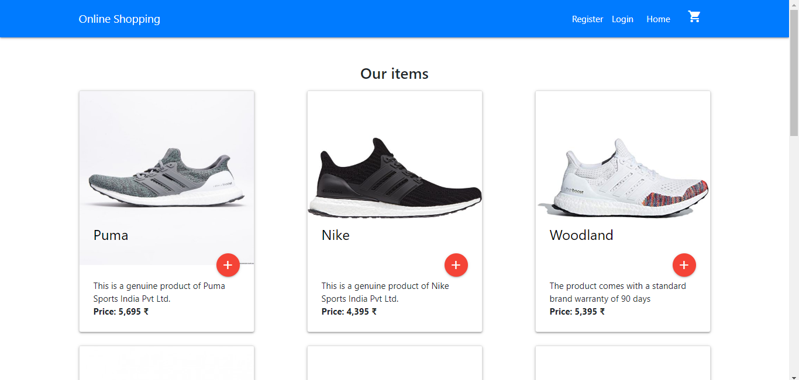
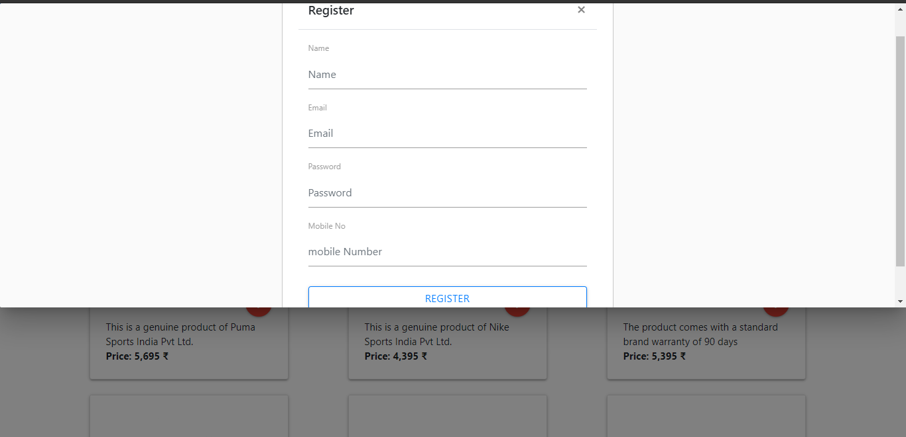
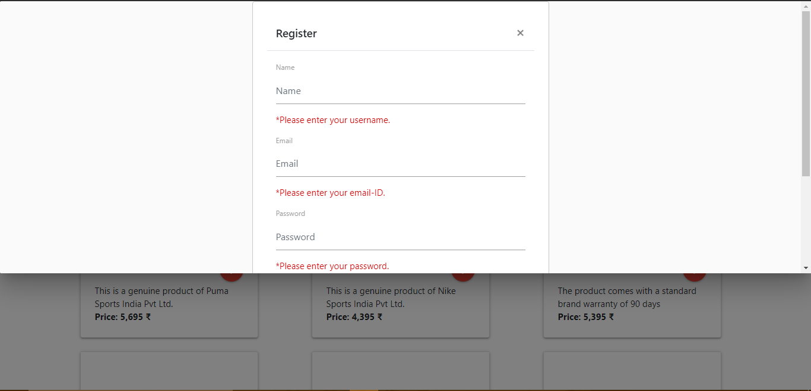
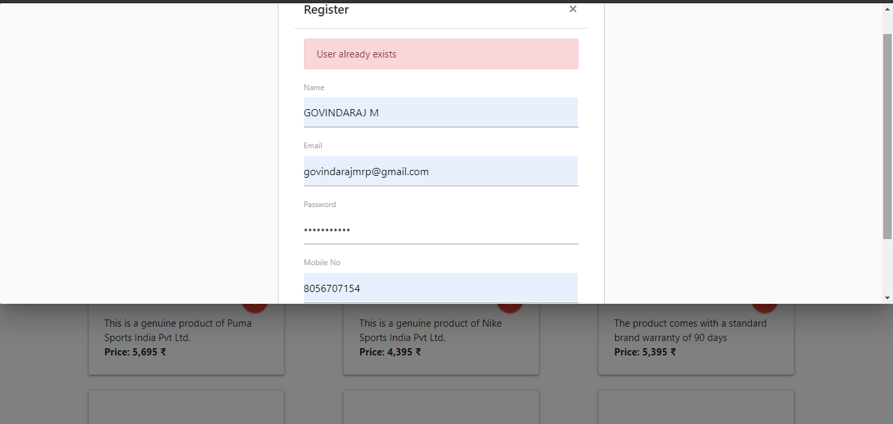
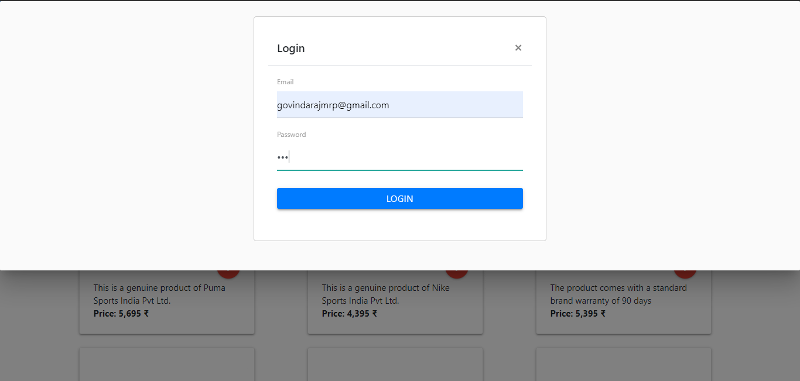
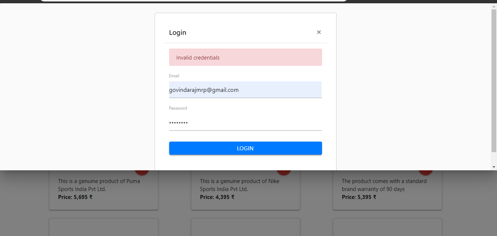
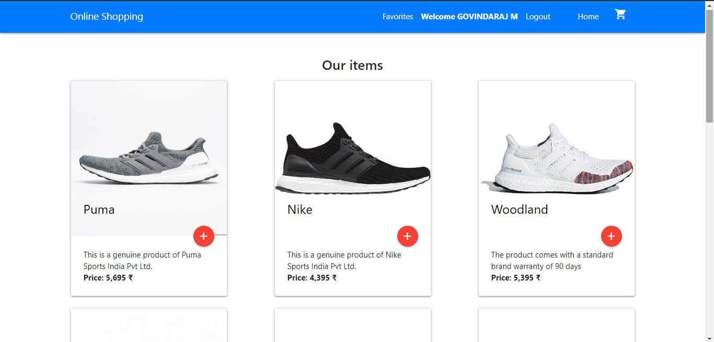
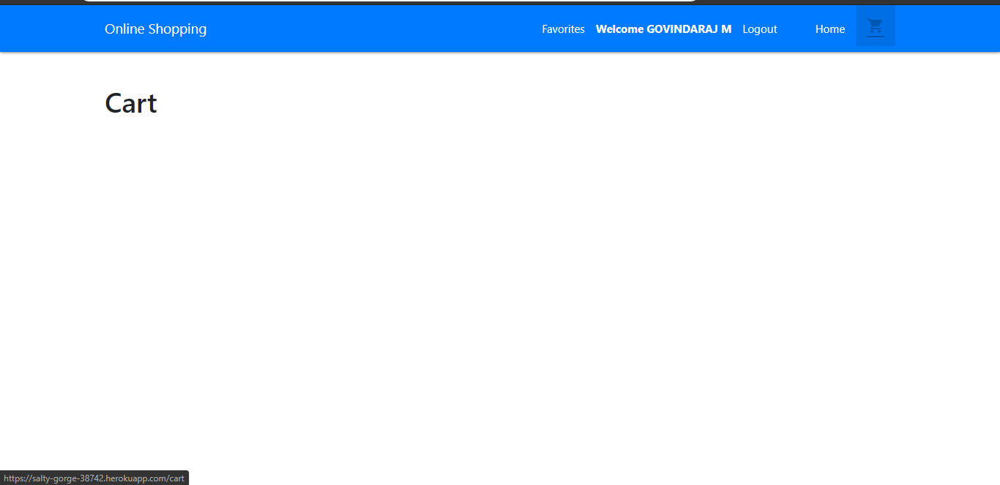
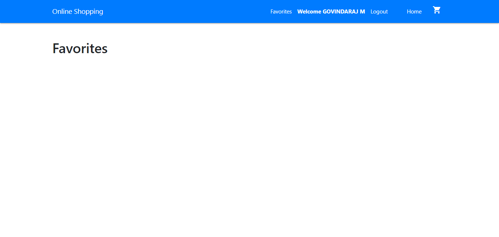
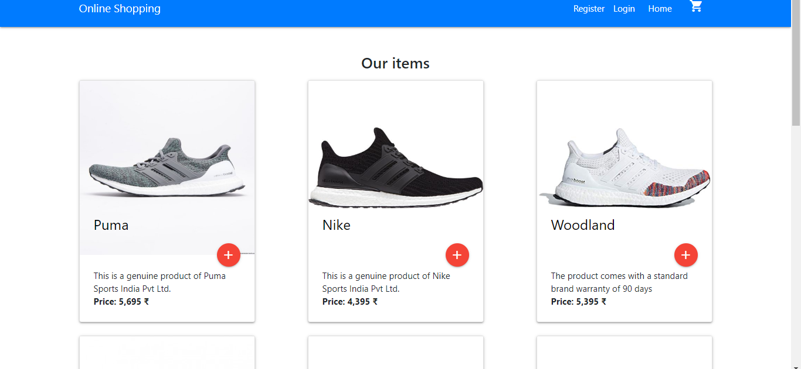

# Online Shopping

> Online Shopping app built with the MERN stack.


### Screenshot

### Home page



### Register page


### Register page with validation


### If the user is exist it'll display the message


### Login page


### Login page with validation


### Dashboard


### cart


### Favorites


### once you logout it'll show you the dashboard


## Steps to Setup
1. Install dependencies

```bash
npm install
```

2. Run Server

```bash
node server.js
```
You can browse the apis at <http://localhost:3000>


## Quick Start

Add your MONGO_URI to the default.json file. Make sure you set an env var for that and the jwtSecret on deployment

```bash
# Install dependencies for server
npm install

# Install dependencies for client
npm run client-install

# Run the client & server with concurrently
npm run dev

# Run the Express server only
npm run server

# Run the React client only
npm run client

# Server runs on http://localhost:5000 and client on http://localhost:3000
```

## Deployment

There is a Heroku post build script so that you do not have to compile your React frontend manually, it is done on the server. Simply push to Heroku and it will build and load the client index.html page

## App Info

### Author

Govindaraj
 
